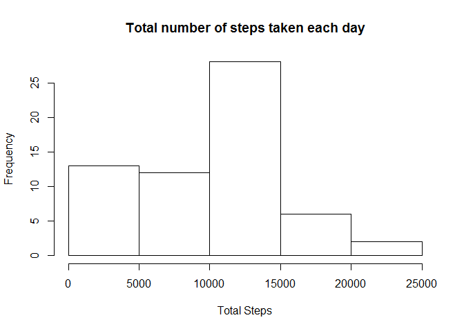
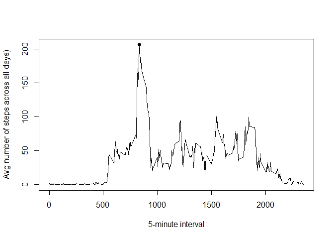
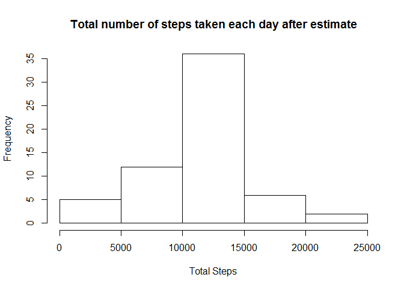
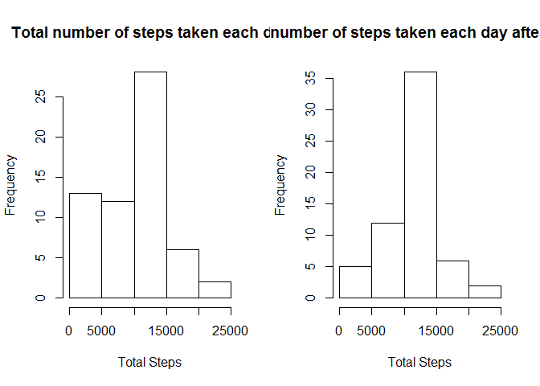
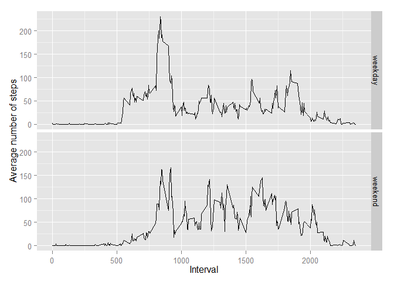

# Reproducible Research: Peer Assessment 1


## Loading and preprocessing the data

```r
require(dplyr)
require(lubridate)
require(ggplot2)

ZIP_FILE <- "activity.zip"
DATA_FILE <-"activity.csv"
if(!file.exists(DATA_FILE)){
  unzip(ZIP_FILE)  
}

data <- read.csv(DATA_FILE)
```


## What is mean total number of steps taken per day?

**Make a histogram of the total number of steps taken each day**


```r
q1 <- summarise(group_by(data,date),total_steps=sum(steps, na.rm=TRUE))   
hist(q1$total_steps, xlab="Total Steps",main="Total number of steps taken each day")
```

 

**Calculate and report the mean and median total number of steps taken per day:**


```r
stepMean <- mean(q1$total_steps)
stepMedian <- median(q1$total_steps)
```
**Mean:** 9354.2295082

**Median:** 10395

## What is the average daily activity pattern?

**Make a time series plot of the 5-minute interval (x-axis) and the average number of steps taken, averaged across all days (y-axis)**

```r
q2 <- summarise(group_by(data,interval),avg_steps=mean(steps, na.rm=TRUE))   
plot(q2$interval,q2$avg_steps,type="l"
       ,ylab="Avg number of steps across all days)"
       ,xlab="5-minute interval")

points(q2[which.max(q2$avg_steps),],pch=19)
```

 

**Which 5-minute interval, on average across all the days in the dataset, contains the maximum number of steps?**

```r
q2[which.max(q2$avg_steps),]
```

```
## Source: local data frame [1 x 2]
## 
##   interval avg_steps
## 1      835  206.1698
```


## Imputing missing values

**Calculate and report the total number of missing values in the dataset**


```r
nrow(data[!complete.cases(data),])
```

```
## [1] 2304
```

**Fill all the NA data as the *MEAN* of the same interval, then create the new dataset**


```r
naData <- data[!complete.cases(data),]
completeData <- data[complete.cases(data),]

newData <- naData %>%
  left_join(q2) %>%
  mutate(steps = round(avg_steps)) %>%   
  select(-avg_steps) %>%
  rbind(completeData)
```

**Make a histogram of the total number of steps taken each day**


```r
q3 <- summarise(group_by(newData,date),total_steps=sum(steps, na.rm=TRUE))   
hist(q3$total_steps, xlab="Total Steps",main="Total number of steps taken each day after estimate")
```

 

**Calculate and report the mean and median total number of steps taken per day**


```r
newStepMean <- mean(q1$total_steps)
newStepMedian <- median(q1$total_steps)
```
**New Mean:** 9354.2295082

**New Median:** 10395

**Difference between the current estimates and the first part of the assignment**

```r
par(mfrow=c(1,2))

hist(q1$total_steps, xlab="Total Steps",main="Total number of steps taken each day")
hist(q3$total_steps, xlab="Total Steps",main="Total number of steps taken each day after estimate")
```

 


## Are there differences in activity patterns between weekdays and weekends?

**Create a new factor variable in the dataset with two levels – “weekday” and “weekend” indicating whether a given date is a weekday or weekend day.**


```r
newData <- newData %>%
  mutate(date=ymd(date)) %>%
  mutate(weekd=ifelse((wday(date)==7 | wday(date)==1),"weekend","weekday")) %>%
  mutate(weekd=as.factor(weekd))
```

**Make a panel plot containing a time series plot of the 5-minute interval (x-axis) and the average number of steps taken, averaged across all weekday days or weekend days (y-axis).**


```r
q4 <- summarise(group_by(newData,interval,weekd),avg_steps=mean(steps, na.rm=TRUE))   
g <- ggplot(q4,aes(interval, avg_steps))+
        facet_grid(weekd~.) +        
        geom_line() + 
        labs(x = "Interval",y="Average number of steps")
print(g)
```

 

